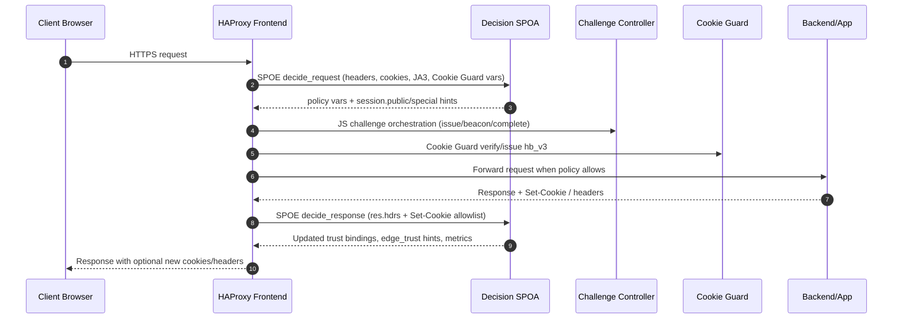

# decision-spoa

`decision-spoa` is a Go-based Stream Processing Offload Agent (SPOA) for HAProxy. It evaluates incoming requests against Artefactual’s policy rules, enriches them with GeoIP data, and returns the actions HAProxy should apply (bucket, JavaScript challenge, varnish routing, reason code). The project also ships a companion CLI to download and refresh the MaxMind databases used by the agent.

- Policy decisions are determined by backend/frontend defaults plus rule evaluations in `internal/policy`.
- GeoIP lookups rely on the MaxMind City and ASN databases and can be hot-reloaded with `SIGHUP`.
- Prometheus metrics report policy outcomes, rule hits, and GeoIP lookup telemetry.
- Session tracking keeps lightweight “public” stats for every client plus a “special” table populated from backend headers/cookies defined in `context.yml`; additional Prometheus metrics expose trust hints, table occupancy, and Cookie Guard token age distributions.

### Public-Session Tracking (What req/hits/rate mean)

Decision maintains an in‑memory "public" session entry keyed by a durable identifier and exposes several fields back to HAProxy via `var(txn.decision.*)` and to the logs when `--debug` is enabled:

- `session.public.key`: opaque hash used as the session identifier. Source precedence:
  - `cookieguard_session` → `hb_v3` → `hb_v2` → fallback `ua_ip` (derived client IP + User‑Agent).
- `session.public.key_source`: which source was used (`cookieguard_session`, `hb_v3`, `hb_v2`, or `ua_ip`).
- `session.public.req_count` (logged as `req`): total requests observed for this key since the Decision process started (or until the key is evicted by LRU).
- `session.public.recent_hits` (logged as `hits`): requests for this key within the rolling window.
- `session.public.rate_window_seconds`: size of the rolling window in seconds.
- `session.public.rate` (logged as `rate`): per‑second rate over the rolling window, computed as `recent_hits / rate_window_seconds`. For per‑minute, multiply by 60.
- `session.public.idle_seconds`: time since this key last appeared.
- `session.public.first_path` + `first_path_deep`: first path seen for the key and a boolean indicating whether it looks like a "deep" path.

Configuration knobs:

- Window and capacity
  - `--session-public-window` (env `DECISION_SESSION_PUBLIC_WINDOW`) controls the rolling window; default `1m`, often set to `5m`.
  - `--session-public-max` (env `DECISION_SESSION_PUBLIC_MAX`) caps the number of public entries; LRU eviction applies when exceeded.
- Metrics
  - Prometheus gauges/counters include `decision_session_public_entries`, `decision_session_public_evictions_total`, and `decision_session_key_source_total{source="ua_ip|hb_v2|hb_v3|cookieguard_session"}` to monitor table pressure and the mix of key sources.

Notes:

- Counts are per Decision process. They reset on restart and when a key is evicted by LRU.
- If you call Decision in both the frontend and a backend, the same request will be recorded twice; for backend‑only counting, run the session tracking only on the backend call (or remove the frontend decide_request).



## Binaries

| Command | Description |
| --- | --- |
| `decision-spoa` | The SPOA daemon HAProxy connects to. |
| `decision-geoip-db-updates` | Helper CLI that downloads and swaps the GeoIP databases atomically. |
| `decision-configcheck` | Validates a policy directory without starting the daemon (think `nginx -t`). |

Both binaries expose `-h` for full flag usage. Every flag also has an equivalent environment variable (see below).

## Requirements

- Go 1.25+
- MaxMind GeoLite2 City and ASN databases (optional but recommended)
- HAProxy 2.0+ with SPOE support

## Building

```bash
make build
```

The Makefile produces stripped binaries in `./build/`. It also injects version, commit, and build date metadata sourced from the local git checkout.

To build manually:

```bash
env GOTOOLCHAIN=local go build -trimpath -o build/decision-spoa ./cmd/decision-spoa
env GOTOOLCHAIN=local go build -trimpath -o build/decision-geoip-db-updates ./cmd/decision-geoip-db-updates
env GOTOOLCHAIN=local go build -trimpath -o build/decision-configcheck ./cmd/decision-configcheck
```

## Running the SPOA

```bash
./build/decision-spoa \
  --listen 127.0.0.1:9908 \
  --metrics 127.0.0.1:9907 \
  --root /etc/decision-policy \
  --city-db /var/lib/GeoIP/GeoLite2-City.mmdb \
  --asn-db /var/lib/GeoIP/GeoLite2-ASN.mmdb
```

Append `--check-config` to validate the policy directory and exit without starting the service.

The Debian/RPM packages install a `decision-spoa.service` systemd unit that uses `/etc/default/decision-spoa` to pass CLI options. The stock configuration listens on `127.0.0.1:9908`, exposes metrics on `127.0.0.1:9907`, and enables best-effort GeoIP downloads. Optional high-cardinality metrics remain disabled unless you set `DECISION_METRICS_HOST_LABEL`/`DECISION_METRICS_GEOIP` in that file.

### Flags and environment variables

| Flag | Env var | Default | Notes |
| --- | --- | --- | --- |
| `--listen` | `DECISION_LISTEN` | `127.0.0.1:9107` | TCP address HAProxy connects to (packages override to `127.0.0.1:9908`). |
| `--metrics` | `DECISION_METRICS` | `127.0.0.1:9907` | Prometheus HTTP endpoint (`/metrics`). |
| `--root` | `DECISION_ROOT` | `/etc/decision-policy` | Directory containing policy config files. |
| `--debug` | `DECISION_DEBUG` | disabled | Enables verbose policy logs (see below). |
| `--metrics-host-label` | `DECISION_METRICS_HOST_LABEL` | disabled | Adds the `host` label to metrics (higher cardinality). |
| `--metrics-geoip` | `DECISION_METRICS_GEOIP` | disabled | Exports GeoIP metrics (`decision_policy_geo_lookups_total`, country, ASN counters). |
| `--metrics-challenge-level` | `DECISION_METRICS_CHALLENGE_LEVEL` | disabled | Emits `decision_challenge_level_asn_total` (per-ASN challenge level counts); leave off unless troubleshooting. |
| `--city-db` | `GEOIP_CITY_DB` | `/var/lib/GeoIP/GeoLite2-City.mmdb` | Path to City database. Optional but enables country lookups. |
| `--asn-db` | `GEOIP_ASN_DB` | `/var/lib/GeoIP/GeoLite2-ASN.mmdb` | Path to ASN database. |
| `--city-url` | `GEOIP_CITY_URL` | empty | Download URL consumed by the update helper. |
| `--asn-url` | `GEOIP_ASN_URL` | empty | Download URL consumed by the update helper. |
| `--best-effort` | n/a | `true` | Ignore GeoIP download errors when set. |
| `--session-public-max` | `DECISION_SESSION_PUBLIC_MAX` | `200000` | Maximum entries tracked in the public (all-clients) session table. |
| `--session-public-window` | `DECISION_SESSION_PUBLIC_WINDOW` | `1m` | Sliding window used to compute the short-term request rate per public session. |
| `--session-special-max` | `DECISION_SESSION_SPECIAL_MAX` | `50000` | Maximum entries tracked in the special (trusted) session table. |

Send `SIGHUP` to the running process to reload the policy configuration and reopen the GeoIP databases without interrupting HAProxy connections.

#### Debug logging

When `--debug` (or `DECISION_DEBUG`) is enabled the daemon prints an expanded policy line for every SPOE transaction. The log now includes:

- `raw_input`: every key/value HAProxy delivered via SPOE, sorted for readability.
- `src`, `xff`, and `ip`: the TCP peer, the header presented by HAProxy, and the client IP selected after trusted-proxy processing.
- `xff_used`, `xff_stripped`, and `trusted_peer`: whether the XFF header was honoured, how many trusted hops were removed, and if the immediate peer matches the configured `trusted_proxy` list.
- `trusted_entries`: the combined trusted entries (global + frontend + backend) active for the request.

These extras make it easy to confirm that trusted proxy configuration is in effect and to troubleshoot spoofed headers or misconfigured upstreams.

## Packaging

We use GoReleaser + NFPM to ship `.deb`/`.rpm` artifacts. Installing the package provides:

- `decision-spoa.service` and its companion default file at `/etc/default/decision-spoa`.
- `decision-geoip-db-updates.service` plus the daily `decision-geoip-db-updates.timer` and `/etc/default/decision-geoip-db-updates`.
- A sample HAProxy SPOE config at `/etc/haproxy/decision-spoa.cfg`.
- A starter policy at `/etc/decision-policy/policy.yml`.

The post-install hook ensures `/var/lib/decision` and `/etc/decision-policy` exist and are owned by the `haproxy` account, labels TCP ports 9907/9908 as `http_port_t` under SELinux, reloads systemd, and enables both the main service and the GeoIP timer. The package depends on `haproxy` being present so the service account/group already exist.

Editing the default files is the supported way to change runtime flags. The shipped values look like this:

```sh
# /etc/default/decision-spoa
DECISION_SPOA_OPTS="\
  --listen 127.0.0.1:9908 \
  --metrics 127.0.0.1:9907 \
  --root /etc/decision-policy \
  --city-db /var/lib/decision/GeoLite2-City.mmdb \
  --asn-db /var/lib/decision/GeoLite2-ASN.mmdb \
  --city-url https://hub-data.crowdsec.net/mmdb_update/GeoLite2-City.mmdb \
  --asn-url https://hub-data.crowdsec.net/mmdb_update/GeoLite2-ASN.mmdb \
  --best-effort"

# Optional toggles; uncomment as needed.
# DECISION_DEBUG=1
# DECISION_METRICS_HOST_LABEL=1
# DECISION_METRICS_GEOIP=1

# /etc/default/decision-geoip-db-updates
DECISION_GEOIP_DB_UPDATES_OPTS="\
  --city-out /var/lib/decision/GeoLite2-City.mmdb \
  --asn-out /var/lib/decision/GeoLite2-ASN.mmdb \
  --city-url https://hub-data.crowdsec.net/mmdb_update/GeoLite2-City.mmdb \
  --asn-url https://hub-data.crowdsec.net/mmdb_update/GeoLite2-ASN.mmdb \
  --best-effort"
```

After editing either file, run `systemctl restart decision-spoa` or trigger the updater manually with `systemctl start decision-geoip-db-updates.service`.

### HAProxy integration

Decision now consumes two SPOE groups: a request group that gathers the usual client metadata plus Cookie Guard outputs, and a response group that ships backend headers/cookies so the session brain can learn which browsers are trusted. Configure your frontends so Decision still runs first, followed by the JavaScript challenge controller and Cookie Guard:

```haproxy
frontend fe_proxy
    http-request set-var(txn.decision_frontend) fe_proxy
    http-request set-var(txn.decision_backend) %[be_id]
    http-request send-spoe-group decision decide_request
    http-request use-service lua.challenge-controller if { var(txn.decision.use_challenge) -m bool }
    http-request set-var(txn.cookieguard.mode) %[var(txn.decision.challenge_mode)]
    http-request lua.cookie-guard
    http-response send-spoe-group decision decide_response
```

SPOE argument reference
- Request group (decide_request)
  - Required for policy matching: `src`, `xff`, `ua` (User‑Agent), `host`, `path`, `method`, `query`, `frontend`, `backend`.
  - Optional but supported matchers: `ssl_sni` (TLS SNI), `ja3` (TLS fingerprint), `protocol` (defaults to `http`).
  - Cookie‑Guard telemetry (optional but recommended): `cookieguard_valid`, `cookieguard_age`, `cookieguard_level`, `cookieguard_session`.
  - Session key carry‑over: `session.public.key` (echo the key returned by a previous decide_request).
- Response group (decide_response)
  - Response headers: `res.hdrs` (full header block, recommended) or individual variables set upstream via `http-response set-var`.
  - Session key carry‑over: `session.public.key` (mirror of `var(txn.decision.session.public.key)`), so Decision can correlate response signals with the correct session entry.

Notes
- The canonical, end‑to‑end HAProxy example that uses these messages lives under `docs/ansible-haproxy-decision/haproxy.cfg` and shows Cookie‑Guard ALTCHA integration plus Coraza and Varnish wiring.

The sample SPOE file mirrors this layout:

```haproxy
[decision]
spoe-agent decision
    option var-prefix decision
    groups decide_request decide_response
    option pipelining
    timeout hello      2s
    timeout idle       30s
    timeout processing 1500ms
    use-backend decision_spoa_backend
    log global

spoe-message decide_request
    args src=src \
         method=method \
         path=path \
         query=query \
         host=hdr(host) \
         ua=hdr(User-Agent) \
         xff=hdr(X-Forwarded-For) \
         ssl_sni=ssl_fc_sni \
         frontend=var(txn.decision_frontend) \
         backend=var(txn.decision_backend) \
         req_cookies=hdr(cookie) \
         cookieguard_valid=var(txn.cookieguard.valid) \
         cookieguard_age=var(txn.cookieguard.age_seconds) \
         cookieguard_level=var(txn.cookieguard.challenge_level) \
         cookieguard_session=var(txn.cookieguard.session_hmac)

spoe-message decide_response
    args frontend=var(txn.decision_frontend) \
         backend=var(txn.decision_backend) \
         res.hdrs=res.hdrs \
         session.public.key=var(txn.decision.session.public.key)

spoe-group decide_request
    messages decide_request
spoe-group decide_response
    messages decide_response
```

### SPOE Inputs and Outputs

The tables below list the request/response variables exchanged between HAProxy and Decision.

**Inputs (HAProxy → Decision)**

| Name | Required? | Source | Purpose |
| --- | --- | --- | --- |
| `src` | Yes | implicit | Socket peer IP (before trusted stripping) |
| `xff` | Optional | `hdr(X-Forwarded-For)` | Used with `src` + trusted list to find real client IP |
| `ua` | Yes | `hdr(User-Agent)` | Regex matching and UA+IP fallback for session keys |
| `host` | Yes | `hdr(host)` | Host-based rules/scopes |
| `path` | Yes | `path` | Regex/path matching |
| `method` | Yes | `method` | `match.method` comparisons |
| `query` | Yes | `query` (raw string, no `?`) | Regex on query params |
| `ssl_sni` | Optional | `ssl_fc_sni` | SNI matches (if TLS info available) |
| `ja3` | Optional | `ssl_fc_ja3_hash` (HAProxy ≥2.5) | JA3/TLS fingerprint matching |
| `frontend` / `backend` | Yes | Vars set by HAProxy (`set-var(txn.decision_frontend/backend)`) | Scope defaults/rules, Prom labels |
| `req_cookies` | Optional | `hdr(cookie)` | Session fallback (UA+IP vs cookies) |
| `cookieguard_valid` | Optional | `var(txn.cookieguard.valid)` | Whether hb_v2/hb_v3 verified |
| `cookieguard_age` | Optional | `var(txn.cookieguard.age_seconds)` | Age of the verified token |
| `cookieguard_level` | Optional | `var(txn.cookieguard.challenge_level)` | Challenge tier just issued (only set during challenge) |
| `cookieguard_session` | Optional | `var(txn.cookieguard.session_hmac)` | Durable hb_v3 session hash (requires issue-token) |
| `session.public.key` *(response → request handoff)* | Optional | Resent by HAProxy if you capture it between calls | Keeps session continuity through restarts |
| `res.hdrs` *(response message)* | Optional | Full response headers on `decide_response` | context.yml allowlist (special/public tables) |

**Outputs (Decision → HAProxy)**

Each output becomes `var(txn.decision.<name>)` because the SPOE agent uses `option var-prefix decision`.

| Output | Description / Example uses |
| --- | --- |
| `policy.bucket` | Label for metrics/logs (e.g., `default`, `rate=deny`). Gate routing or PromQL on it. |
| `reason` | Human-friendly reason string; also emitted as plain `reason`. |
| `deny` | Boolean/string. `http-request deny if { var(txn.decision.deny) -m str true }`. |
| `use_varnish` | `use_backend varnish if { var(txn.decision.use_varnish) -m bool true }`. |
| `use_challenge` | Run Cookie Guard/ALTCHA when true. |
| `use_coraza` | Enable/disable Coraza WAF. |
| `rate_bot` | Feed stick-table rate limits: `track-sc0` / `deny` when over threshold. |
| Custom vars (e.g., `policy.challenge_mode`, `policy.backend`, etc.) | Use in ACLs or to propagate context downstream (`set-header`, `set-var`). |
| `session.public.key`, `.req_count`, `.rate`, `.idle_seconds`, `.first_path`, `.first_path_deep`, `.recent_hits`, `.rate_window_seconds` | Inspect/limit session behaviour directly in HAProxy (e.g., `http-request deny if { var(txn.decision.session.public.req_count) gt 1000 }`). |
| `session.special.role`, `.groups`, `.idle_seconds` | Trusted user hints (from context.yml). Skip challenges or grant bypass for known roles. |
| `cookieguard.valid`, `.age_seconds`, `.challenge_level` | Mirror of Cookie Guard telemetry (validity/age/challenge mode). |

All outputs are optional except the ones your HAProxy logic relies on; use `-m bool`/`-m found` guards before acting on them. Defaults + fallback in `policy.yml` ensure the variables you care about are always present.

`res.hdrs` forwards the full response header block, letting Decision’s allowlist in `context.yml` pick the signals that matter. Operators that prefer a strict allowlist at HAProxy can set variables such as `http-response set-var(txn.decision.hdr.atom_authenticated) res.hdr(Atom-Authenticated)` and replace `res.hdrs=res.hdrs` with those individual vars. The request group must include the Cookie Guard outputs shown above so the public session table can hash on the durable session ID rather than raw IP addresses. Decision returns the hashed `session.public.key`, counts/rates, and `session.special.role` back to HAProxy under `var(txn.decision.*)` for use in ACLs or to forward into the response group.

## Policy configuration

All policy data now lives in a single YAML document, `policy.yml`, located under `DECISION_ROOT` (default `/etc/decision-policy`). The file has three main sections: defaults, trusted proxy scopes, and an ordered `rules` array. Rules are evaluated in order until the first match; if no rule matches, the `fallback` rule provides the final response.

```yaml
defaults:
  global:
    policy.bucket: default
    policy.challenge: true
    policy.use_varnish: true
  frontends:
    fe_admin:
      policy.bucket: high
      policy.challenge: true
      policy.use_varnish: false
  backends:
    be_api:
      policy.bucket: default
      policy.challenge: false
      policy.use_varnish: true

trusted_proxy:
  global:
    - 192.0.2.10
    - 2001:db8::5
  frontends:
    fe_admin:
      - 198.51.100.11
  backends:
    be_api:
      - 10.0.0.5

rules:
  - name: admin-bypass
    frontends: ["fe_admin"]
    match:
      host: ["^admin\\.example\\.com$"]
      method: ["GET", "POST"]
      user_agent: ["Observatory"]
    return:
      policy.bucket: admin
      policy.challenge: false
      policy.admin_audit: "true"

  - name: static-cache
    protocols: ["http"]
    match:
      path: ["^/static/"]
      sni: ["^static\\.example\\.com$"]  # optional if you capture SNI
    return:
      policy.use_varnish: true
      policy.challenge: false
      reason: static-cache

  - name: fallback
    fallback: true
    return:
      reason: default-policy
```

The fallback entry acts as the safety net when no earlier rule matches. It should describe the baseline decision your HAProxy configuration expects (for example, setting a catch-all reason or toggling an audit flag). You may leave the `return` map empty if the defaults already cover everything; the agent still enforces an implicit `"default-policy"` reason. If you omit the fallback altogether, the compiler injects that implicit rule, so keeping one is optional. Retain it when you want to document the “otherwise” path explicitly or to perform conditional work such as setting a reason only for unmatched traffic while allowing earlier rules to keep their own values.

### Policy YAML Reference (Complete)

This section documents every supported field in `policy.yml` and how matches are evaluated.

- Top-level keys
  - `defaults` (required)
    - `global`: map of default variables applied to all requests.
    - `frontends`: map keyed by HAProxy frontend name → default variables for traffic that passed through that frontend.
    - `backends`: map keyed by HAProxy backend name → default variables for traffic targeted to that backend.
    - Values are arbitrary keys; common ones we use in examples: `use_varnish` (bool), `use_coraza` (bool), `use_challenge` (bool), `deny` (bool), `rate_bot` (bool), `policy.bucket` (string).
  - `trusted_proxy` (optional)
    - `global`, `frontends`, `backends`: arrays of IPs or CIDRs. Decision strips these trusted hops from X‑Forwarded‑For when resolving the client IP.
  - `rules` (array, ordered)
    - Each rule has: `name` (string), optional `protocols` (array of `http`), optional `frontends` and/or `backends` scope arrays, a `match` object, an obligatory `return` map, and optional `fallback: true`.

- Match object (all fields are optional; multiple values within a field are OR’ed; multiple fields are AND’ed)
  - `country`: list of ISO 3166‑1 alpha‑2 codes (case‑insensitive).
  - `asn`: list of ASNs (integers).
  - `cidr`: list of IPv4/IPv6 CIDR blocks; matches when client IP is within any network.
  - `method`: list of HTTP methods (case‑insensitive).
  - `host`: list of host matchers. Plain strings are exact matches; values containing regex tokens are treated as regex and compiled. Matching is case‑insensitive for exact values and regex‑dependent otherwise.
  - `path`: list of regular expressions matched against the URL path (no scheme/host/query). Example: `^/static/`.
  - `query`: list of regular expressions matched against the raw query string (without the leading `?`). Example: `(^|&)token=[^&]+(&|$)`. Internally these are compiled as QueryRegex.
  - `user_agent`: list of regular expressions matched against the User‑Agent header.
  - `xff`: list of regular expressions matched against the entire X‑Forwarded‑For header after trusted stripping.
  - `sni`: list of regular expressions matched against the TLS SNI (when provided via SPOE).
  - `ja3`: list of regular expressions matched against the JA3/TLS fingerprint (when provided via SPOE).
  - `protocol`: shorthand to constrain a rule by protocol; equivalent to `protocols` when only one value is present. Today only `http` is meaningful.
  - `session_public`: session counters for the public session table
    - `req_count`: numeric comparator map `{ge|gt|le|lt|eq: <number>}`
    - `rate`: numeric comparator map
    - `first_path_regex`: array of regexes for the first path seen
    - `first_path_deep`: boolean (true/false)
    - `idle_seconds`: numeric comparator map
  - `session_special`: trust profile matches
    - `role`: array of roles (strings)
    - `idle_seconds`: numeric comparator map
  - `cookie_guard`: JS challenge telemetry
    - `valid`: boolean
    - `age_seconds`: numeric comparator map
    - `challenge_level`: array of levels (strings)

- Return map
  - `reason` (string): optional human‑readable reason. If omitted, the fallback reason applies (default `"default-policy"`).
  - Any other key/value is returned to HAProxy as a variable. With `option var-prefix decision` in SPOE, HAProxy sees them as `var(txn.decision.<key>)`.
  - Precedence/locking: evaluation is ordered. When a rule sets a variable, that key is locked and later rules cannot override it. The fallback section only fills keys that were not set by any rule.

- Fallback rule
  - Exactly one rule may set `fallback: true`. Its `return` map is applied after all rules to fill missing keys and/or set a final `reason`.
  - If you omit the fallback rule, the agent injects an implicit fallback with `reason: default-policy`.

Notes on session‑driven inputs
- Decision exposes rich session counters and Cookie‑Guard signals to HAProxy and to logs/metrics, and they are also matchable under `session_public`, `session_special`, and `cookie_guard`:
  - Public session (available as `var(txn.decision.session.public.*)` in HAProxy; also printed under `public={...}` in debug logs): `key`, `key_source`, `req_count`, `recent_hits`, `rate`, `rate_window_seconds`, `idle_seconds`, `first_path`, `first_path_deep`.
  - Special session (trusted profile): `session.special.role`, `session.special.groups`, `session.special.idle_seconds`.
  - Cookie‑Guard: `cookieguard.valid` (bool), `cookieguard.age_seconds` (float), `cookieguard.challenge_level` (string).
Examples using session and Cookie‑Guard matchers
```yaml
- name: bursty-client
  match:
    session_public:
      req_count: { ge: 100 }
      rate: { gt: 5 }
      idle_seconds: { lt: 10 }
  return:
    reason: burst-detected

- name: trusted-editor-grace
  match:
    session_special:
      role: ["editor", "authenticated"]
  return:
    use_challenge: false
    reason: editor-grace

- name: fresh-cookie-ok
  match:
    cookie_guard:
      valid: true
      age_seconds: { gt: 2 }
  return:
    reason: cg-fresh
```

Examples
- Match on query parameter value and set a reason without changing other defaults:
  ```yaml
  - name: token-param
    match:
      query: ['(^|&)token=[A-Za-z0-9_-]{20,}(&|$)']
    return:
      reason: has-token
  ```
- Constrain by JA3 and SNI (requires passing `ja3` and `ssl_sni` in the SPOE message):
  ```yaml
  - name: tls-fingerprint
    match:
      sni: ['^api\\.example\\.com$']
      ja3: ['^771,4865']
    return:
      use_challenge: false
      reason: trusted-tls
  ```

### Field-by-Field Mapping (Code → Config/Usage)

The policy engine consumes the following inputs (see `internal/policy/engine.go:Input`). This table explains how each can be used:

- Scope/labeling
  - `Backend`, `Frontend`: used to select defaults and to restrict rules via `backends:` / `frontends:` arrays on a rule.
  - `BackendLabel`, `BackendLabelType`: internal, used only for Prometheus labels (`component`, `component_type`). Not matchable.

- Matchable fields (policy.yml `match:`)
  - `Country` → `country: ["CA", "ES", ...]` (ISO codes, case-insensitive).
  - `ASN` → `asn: [15169, 8075, ...]` (integers).
  - `IP` → match via `cidr: ["203.0.113.0/24", "2001:db8::/32"]`.
  - `Method` → `method: ["GET", "POST"]`.
  - `Host` → `host: ["plain.example.com", "^regex\\.example\\.com$"]` (exact or regex).
  - `Path` → `path: ["^/static/"]` (regex array).
  - `Query` → `query: ["(^|&)token=[^&]+(&|$)"]` (regex array; a.k.a. QueryRegex).
  - `UA` → `user_agent: ["(?i)googlebot", ...]` (regex array).
  - `XFF` → `xff: ["^10\\.", "proxy\.corp$"]` (regex array after trusted stripping).
  - `SNI` → `sni: ["^api\\.example\\.com$"]` (regex array; requires passing `ssl_sni`).
  - `JA3` → `ja3: ["^771,4865"]` (regex array; only if you pass JA3 via SPOE).
  - `Protocol` → `protocol:` (or `protocols:`) — today only `http` is meaningful; default is `http` if unset.

- Session counters and trust profile (now matchable via nested blocks)
  - `SessionPublic*` → `match.session_public.{req_count, rate, first_path_regex, first_path_deep, idle_seconds}`.
  - `SessionSpecial*` → `match.session_special.{role, idle_seconds}`.
  - You can still enforce via HAProxy ACLs when preferred, e.g. `http-request deny if { var(txn.decision.session.public.req_count) gt 1000 }`.

- Cookie‑Guard telemetry (now matchable)
  - `CookieGuardValid` → `match.cookie_guard.valid`.
  - `CookieAgeSeconds` → `match.cookie_guard.age_seconds`.
  - `ChallengeLevel` → `match.cookie_guard.challenge_level`.

- Geo dependencies
  - `Country` and `ASN` require GeoIP DBs to be present (`--city-db`, `--asn-db`). When missing, matches on these fields never fire.

SPOE plumbing notes
- To use SNI/JA3/protocol matchers, include those fields in your `spoe-message` args. The default sample passes `ssl_sni`; add `ja3=<expr>` only if you have a JA3 extractor.
- Query matching operates on the raw query string (`args query=query`); you don’t need to include the `?` in your regex.


## Trusted context (context.yml)

Session tracking and trusted-role hints are configured separately via `context.yml` in the same directory as `policy.yml`. The file declares which response headers/cookies HAProxy should forward, which session table they feed (`public` vs `special`), and any tags to stamp onto the resulting profile. Tags accept `${value}` (the raw backend value) and `${digest}` (after hashing/HMAC), so you can record roles without exposing the underlying session IDs.

```yaml
response:
  mode: allowlist
  headers:
    - name: Atom-Authenticated
      table: special
      tags:
        session.role: "${value}"
    - name: X-Decision-Group
      table: special
      tags:
        session.group: "${value}"
  cookies:
    - name: hb_v3
      table: public
    - name: edge_trust
      table: special
      hash_mode: hmac-sha256
      tags:
        session.role: editor
hash:
  mode: hmac-sha256
  secret_file: secrets/edge_hmac.key
```

Only allowlisted signals are stored even if the SPOE response group forwards every header/cookie. Rotate `secret_file` to change the HMAC key Decision uses before persisting digests; `SIGHUP` reloads both `policy.yml` and `context.yml`.

### Special Sessions (Trusted Table)

The "special" table holds durable trust profiles keyed by a privacy‑safe digest of response signals you allowlist in `context.yml`. Use it to tag authenticated/editor traffic and grant grace (skip heavy challenges, throttle less aggressively) without app changes.

- Keying & hashing
  - Each allowlisted header/cookie can specify `hash_mode` (`plain`, `sha256`, `sha512`, `hmac-sha256`, `hmac-sha512`).
  - The digest (never the raw value when HMAC/SHA is used) becomes the special profile key.
  - Set a global HMAC secret in `hash.secret_file`; SIGHUP to reload.

- Tags
  - `tags:` apply labels to the profile whenever the signal is seen on a response (via the `decide_response` SPOE group).
  - Supported convenience keys: `session.role`, `session.group`/`session.groups` (comma‑separated). Any other key is stored as metadata for debugging.
  - Decision increments `decision_trust_hint_total{hint="role=<value>"}` and `role/group` changes are reflected immediately on the next request that presents the same signal.

- Response vs request semantics
  - Response path (decide_response): creates/updates the special profile and applies `tags`.
  - Request path: "touches" (refreshes) existing profiles when the browser presents an allowlisted cookie, exposing:
    - `session.special.role`, `session.special.groups` and `session.special.idle_seconds` to HAProxy/Policy.
  - Ensure `http-response send-spoe-group decision decide_response` runs after the backend sets headers/cookies you care about.

- Example: coarse auth flag (same value for everyone)
  - Minimal mapping; all authenticated users share one profile key (sufficient for coarse hints):

    ```yaml
    response:
      mode: allowlist
      cookies:
        - name: atom_authenticated
          table: special
          tags:
            session.role: authenticated
    hash:
      mode: hmac-sha256
      secret_file: secrets/edge_hmac.key
    ```

  - Logout: when the cookie is removed/expired by the app, future requests stop "touching" the profile; `session.special.role` disappears. The old entry idles out and is evicted by LRU.

- Example: per‑session auth (preferable when available)
  - Map a per‑session cookie (e.g., Symfony’s) with HMAC to avoid collapsing all users into one key:

    ```yaml
    response:
      mode: allowlist
      cookies:
        - name: symfony
          table: special
          hash_mode: hmac-sha256
          tags:
            session.role: authenticated   # only if any symfony session implies auth in your setup
    ```

  - If anonymous sessions also get this cookie, add a second, stricter signal (or app logic) before tagging `session.role`.

- Observability
  - `decision_session_special_entries` (gauge) and `decision_session_special_evictions_total` track table health.
  - `decision_trust_hint_total{hint="role=<value>"}` counts role assignments.
  - With `--debug-verbose`, logs include `special={role=… idle=… groups=…}` on the same line as the request summary.

Tip: keep the response SPOE only in backends to avoid double‑processing `res.hdrs`. Place it after any `http-response add-header`/`set-header` that synthesizes signals for Decision.

### Rule reference

The table below lists every key supported inside a `rules:` entry. Unless stated otherwise, omit a field to leave it unconstrained.

| Field | Type | Default | Notes |
| --- | --- | --- | --- |
| `name` | string | empty | Optional identifier surfaced in logs/metrics. |
| `protocols` | list of string | `["http"]` | Allowed protocols for the rule. Values are normalised to lowercase. Combine with `match.protocol` when you prefer to keep the protocol filter alongside other match clauses. |
| `frontends` | list of string | any frontend | Limits evaluation to specific HAProxy frontends. |
| `backends` | list of string | any backend | Limits evaluation to specific HAProxy backends. |
| `match` | mapping | `{}` | Field predicates. See the table below for all available matchers. |
| `return` | mapping (string → value) | required | Variables emitted back to HAProxy. Must contain at least one key. The key `reason` (case-insensitive) is treated specially as the policy reason string. |
| `fallback` | boolean | `false` | Marks the rule as the fallback response. Exactly one rule in the file should set this to `true`. |

`match` supports the following keys. Every slice is OR-ed; leave the list empty to skip that matcher.

| Match key | Type | Notes |
| --- | --- | --- |
| `protocol` | list of string | Same semantics as top-level `protocols`; combined with that list. |
| `host` | list of string | Exact matches when the value lacks regex tokens, or Go regular expressions otherwise. Host names are matched case-insensitively. |
| `path` | list of regex | Go regular expressions evaluated against the HTTP path. |
| `method` | list of string | Case-insensitive exact matches (e.g., `GET`, `POST`). |
| `query` | list of regex | Go regular expressions matched against the raw query string. |
| `xff` | list of regex | Regular expressions matched against the full `X-Forwarded-For` header received from HAProxy. |
| `user_agent` | list of regex | Regular expressions evaluated against the `User-Agent` header. |
| `sni` | list of regex | Regular expressions evaluated against the TLS SNI (requires HAProxy to forward `ssl_fc_sni`). |
| `ja3` | list of regex | Regular expressions evaluated against the JA3 hash (requires `ssl_fc_ja3_hash`). |
| `country` | list of string | ISO 3166-1 alpha-2 country codes compared against the GeoIP lookup result. |
| `asn` | list of uint | ASN numbers compared against the GeoIP lookup result. |
| `cidr` | list of CIDR strings | IPv4/IPv6 ranges checked against the client IP after trusted-proxy stripping. |

Values placed under `return` are merged into the output in declaration order. Regular rules use “first writer wins”: once a variable is set by a matching rule it stays locked for the remainder of the evaluation. The fallback rule runs last with a “fill in the blanks” strategy, only populating keys that were never set earlier.

**Reason string.** The special `reason` key controls the human-readable explanation returned to HAProxy and exported in the `decision_policy_decisions_total{reason=...}` metric. The first matching rule that sets `reason` keeps it locked; fallback only assigns a reason when none was provided earlier. If you omit the key entirely, the agent emits `"default-policy"` as the final reason.

### Defaults precedence

The `defaults` section seeds every evaluation in three layers:

- Start with `defaults.global`.
- If the SPOE transaction came through a named frontend, merge `defaults.frontends[frontend]`.
- Finally, merge `defaults.backends[backend]`.

Because later merges overwrite earlier values, backend-specific defaults win over frontend defaults, and frontend defaults win over the global baseline. If you prefer the frontend settings to take precedence, leave the backend stanza empty or keep the frontend-specific logic inside explicit `rules` entries that run before backend-scoped rules.

### Match semantics

- All match lists are OR-ed. `host` entries default to exact matches unless you include regex tokens (`^`, `*`, `[]`, etc.); `path`, `xff`, `user_agent`, `query`, `sni`, and `ja3` entries are compiled as Go regular expressions.
- `method` comparisons are case-insensitive exact matches (e.g., `GET`, `POST`).
- `sni` and `ja3` clauses are optional—include them only if your HAProxy build exports those fields via SPOE.
- JA3 fingerprints require HAProxy 2.5+ (community builds added `ssl_fc_ja3_hash` in that release). JA4 still needs 2.9+ or an external TLS terminator that forwards the hash. Builds ≤2.4 cannot expose the client hello to SPOE, so leave those matchers out there.
- `country` expects ISO alpha-2 codes. `asn` takes unsigned integers. `cidr` supports IPv4/IPv6 ranges in CIDR notation.
- Scope filters (`frontends`, `backends`, `protocols`) constrain where the rule can run. Omit the field to allow every value. Protocol names are lower-cased strings; `http` is assumed if none are supplied.
- `return` is an arbitrary key/value map. Nothing is reserved—emit whichever variables you intend to consume in HAProxy (e.g., `policy.bucket`, `policy.challenge`, custom flags), and gate behaviour there with `var()` checks.
- Rules that don’t unlock any new variables (because every key they want to set is already locked by an earlier rule) are skipped silently: they do not change `reason`, they don’t produce Prometheus rule-hit metrics, and HAProxy never sees them. Ordering still matters—first matching rule wins ownership of each key—but this skip keeps metrics meaningful and mirrors the “first writer wins” semantics in behaviour as well as observability.

Always end the file with a `fallback` rule. The agent will merge fallback values with the defaults so you can keep using the existing global/front/back `defaults` structure.

### Validating policy and context

Use the standalone config checker before deploying changes:

```bash
./build/decision-configcheck --root /etc/decision-policy
```

The command loads and compiles `policy.yml` and `context.yml`. It exits non-zero on parse errors, invalid CIDR blocks, bad regular expressions, unknown match fields, or missing defaults. When `context.yml` is present it also reads the HMAC secret (if configured) and prints a brief summary (counts and hash mode).

### Rule Design Tips

- Prefer the cheapest checks first. Country/ASN comparisons are fast; regexes over `path`/`query` are slower. Order high-selectivity rules early so traffic exits quickly.
- Use literal matches whenever the field supports them. For `host`, `path`, `user_agent`, and `sni`, list plain strings unless you genuinely need regex tokens—literal matches are faster and easier to reason about.
- When you do need regex, anchor expressions (`^` / `$`) and keep them as narrow as possible to avoid backtracking.
- Keep shared lists small and explicit (e.g., break “cloud” CIDRs into labeled subsets) so operators can reason about impact. Repeatedly referenced sets belong in `shared/` files.
- Watch Prometheus metrics (`decision_policy_rule_hits_total`, `decision_policy_eval_seconds`) after adding rules. Spikes in eval time usually signal expensive regex chains or catch-all matchers firing too often.
- Aim for idempotent merges: set only the variables you need in each rule and rely on defaults for everything else. That keeps config readable and limits accidental overrides.

### HAProxy Integration Example

The snippet below sketches how you might wire this SPOA alongside Coraza (WAF), JS-cookie challenges, and Varnish. Replace placeholders with your actual listener addresses, certificates, and ACLs.

```haproxy
# SPOE agents
spoe-agent decision-spoa
    messages policy-eval
    option var-prefix policy
    use-backend policy-servers if TRUE

spoe-message policy-eval
    args \
        ip=src \
        method=method \
        path=path \
        query=query \
        hdr_host=hdr(host) \
        hdr_ua=hdr(User-Agent) \
        xff=hdr(X-Forwarded-For) \
        ssl_sni=ssl_fc_sni

spoe-agent coraza-waf
    messages coraza-eval

frontend https-in
    bind 0.0.0.0:443 ssl crt /etc/haproxy/certs/example.pem crt /etc/haproxy/certs/example2.pem
    acl host_fqdn1 hdr(host) -i fqdn1.example.com
    acl host_fqdn2 hdr(host) -i fqdn2.example.com
    acl src_exempt_coraza_fqdn1 ip 5.6.7.0/25
    acl src_exempt_coraza_fqdn2 asn 8075          # Azure ASN example

    # Run Coraza unless explicitly exempted
    use-server coraza-waf if ! (host_fqdn1 src_exempt_coraza_fqdn1) ! (host_fqdn2 src_exempt_coraza_fqdn2)

    # Always call the policy SPOA
    use-server decision-spoa

    default_backend policy-router

backend policy-router
    acl want_varnish var(policy.use_varnish) -m bool true
    use_backend varnish-backend if want_varnish
    acl is_fqdn1 var(policy.backend) -i fqdn1
    use_backend fqdn1-backend if is_fqdn1
    use_backend fqdn2-backend

backend varnish-backend
    server varnish1 127.0.0.1:6081

backend fqdn1-backend
    acl skip_js var(policy.challenge) -m bool false
    http-response set-header Set-Cookie "js_challenge=ok; Path=/; Secure" if skip_js
    server fqdn1 127.0.0.1:80

backend fqdn2-backend
    server fqdn2 127.0.0.1:80
```

And the matching `policy.yml` could look like:

```yaml
defaults:
  global:
    policy.use_varnish: true
    policy.use_coraza: true
    policy.challenge: true
    policy.backend: default
  backends:
    fqdn1:
      policy.backend: fqdn1
    fqdn2:
      policy.backend: fqdn2

trusted_proxy:
  global: []

rules:
  - name: allow-search-bots
    match:
      asn: [15169, 8075]
      user_agent:
        - '(?i)googlebot'
        - '(?i)bingbot'
    return:
      policy.challenge: false
      reason: allow-search-bots

  - name: block-cn
    match:
      country: [CN]
    return:
      policy.bucket: deny
      policy.challenge: false
      policy.use_varnish: false
      reason: deny-cn

  - name: skip-js-canada-azure
    match:
      country: [CA]
      asn: [8075]
    return:
      policy.challenge: false
      reason: skip-js-ca-azure

  - name: fqdn1-us-no-challenge
    backends: [fqdn1]
    match:
      country: [US]
    return:
      policy.challenge: false
      reason: fqdn1-us

  - name: fqdn1-ca-force-challenge
    backends: [fqdn1]
    match:
      country: [CA]
    return:
      policy.challenge: true
      reason: fqdn1-ca

  - name: fqdn1-bypass-varnish
    backends: [fqdn1]
    match:
      cidr: ['1.2.3.0/24']
      asn: [16276]          # OVH
    return:
      policy.use_varnish: false
      reason: fqdn1-direct

  - name: fqdn2-chatgpt
    backends: [fqdn2]
    match:
      user_agent: ['ChatGPT']
    return:
      policy.challenge: false
      reason: fqdn2-chatgpt

  - name: fqdn2-no-varnish
    backends: [fqdn2]
    return:
      policy.use_varnish: false
      reason: fqdn2-direct

  - name: fe-fqdn1-coraza-exempt
    frontends: [https-in]
    match:
      host: ['^fqdn1\.example\.com$']
      cidr: ['5.6.7.0/25']
    return:
      policy.use_coraza: false
      reason: coraza-exempt-fqdn1

  - name: fe-fqdn2-coraza-azure
    frontends: [https-in]
    match:
      host: ['^fqdn2\.example\.com$']
      asn: [8075]
    return:
      policy.use_coraza: false
      reason: coraza-exempt-fqdn2

  - name: fallback
    fallback: true
    return:
      reason: default-policy
```

In HAProxy you can then gate behaviors with `var(policy.use_coraza) -m bool true`, `var(policy.challenge)`, etc., only acting when the variable exists. This keeps the SPOA fully declarative and leaves all enforcement to HAProxy. When you need a new signal, just add a key in the policy output and wire it into the HAProxy ACLs.

If you need reusable lists (for example bot user agents or high-risk CIDR blocks), embed them directly in `policy.yml` using YAML anchors/aliases or generate the file from templates during deployment. Only the keys listed in the rule reference (`user_agent`, `asn`, `cidr`, `path`, etc.) are understood by the agent; variations such as `user_agent_contains`, `user_agent_regex`, `path_prefix`, or `path_suffix` are not recognised and `decision-configcheck` now reports them as unknown match fields.

"`<scope>`" expands to:

- `default/` — base rules applied to every request unless a frontend/backend rule overrides them.
- `frontends/<frontend-name>/` — only evaluated for requests routed through the named HAProxy frontend. Use this to loosen or tighten policies for a specific entry point (e.g., admin UI).
- `backends/<backend-name>/` — highest precedence. Use for per-service exceptions (e.g., allow an API endpoint to bypass caches).

Rules cascade according to scope precedence (**backend ➜ frontend ➜ default ➜ global default**). Within a scope, evaluation is ordered and still honours the “first writer wins” behaviour: once a variable is set by an earlier match it stays locked for the rest of the evaluation. When a scope has no files for a given engine, evaluation falls back to the next scope automatically.

Trusted proxy lists follow the same precedence: global entries are always applied, then frontend-specific entries (if the request came through that frontend), and finally backend-specific entries. The agent strips every matching trailing hop from `X-Forwarded-For` so rule matching always sees the true client IP.

Policy evaluation order and Prometheus instrumentation live in `internal/policy/engine.go`; extend this package when introducing new rule types or actions.

## GeoIP database refresh helper

The `decision-geoip-db-updates` utility downloads GeoLite tarballs or raw `.mmdb` files, compares them by SHA-256 hash, and atomically replaces the on-disk files.

```bash
./build/decision-geoip-db-updates \
  --city-url https://example/GeoLite2-City.mmdb.tar.gz \
  --asn-url https://example/GeoLite2-ASN.mmdb.tar.gz \
  --city-out /var/lib/GeoIP/GeoLite2-City.mmdb \
  --asn-out /var/lib/GeoIP/GeoLite2-ASN.mmdb
```

With `--best-effort` (or the default), the helper exits successfully even when the remote files are unavailable or unchanged.

## Observability

- Prometheus metrics are exposed at `http://<metrics addr>/metrics`.
- Key series include:
  - `decision_policy_decisions_total{backend,host?,bucket,reason}`
  - `decision_policy_rule_hits_total{backend,host?,rule}`
  - `decision_policy_eval_seconds`
  - `decision_policy_geo_lookups_total{outcome}` with outcomes `ok`, `error`, or `no_db`
  - `decision_policy_country_hits_total{country}`
  - `decision_policy_asn_hits_total{asn}`
  - `decision_policy_xff_trusted_strips_total{backend,host?}` (count of XFF hops removed via trusted lists)

Leave the host label and GeoIP metrics disabled unless you are troubleshooting (`--metrics-host-label`, `--metrics-geoip`).

## Upgrade guide

1. Update systemd units, container entrypoints, and HAProxy configs to call the new binaries (`decision-spoa`, `decision-geoip-db-updates`, `decision-configcheck`). The CLI flags are unchanged.
2. Export the new environment variables (`DECISION_LISTEN`, `DECISION_METRICS`, `DECISION_ROOT`, `DECISION_DEBUG`, `DECISION_METRICS_HOST_LABEL`) if you override defaults.
3. Refresh HAProxy SPOE declarations so they reference the new agent name if you mirrored the binary name in config snippets (for example, `spoe-agent decision-spoa`).
4. Point dashboards and alerts at the `decision_policy_*` Prometheus series.
5. Update Go callers/imports to the new module path (`github.com/artefactual-labs/decision-spoa`) before building downstream tooling.

## Development

- Run unit tests: `go test ./...`
- Linting / formatting: follow standard Go tooling (`go fmt`, `go vet`) as needed.
- The project targets Go 1.21; update `go.mod` and CI/CD pipelines accordingly when upgrading.

## License

This project is distributed under the terms of the GNU Affero General Public License v3.0 (see `LICENSE`).
