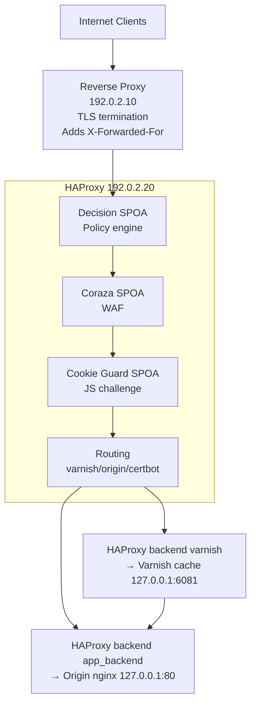

# Artefactual Decision Stack – Customer Guide

This guide explains, in plain language, how the security stack deployed by [artefactual-labs/ansible-haproxy-decision](https://github.com/artefactual-labs/ansible-haproxy-decision) protects the service running at `decision-demo.example.net`. It assumes no prior knowledge of [HAProxy](https://www.haproxy.org), SPOA agents, or the [Decision](https://github.com/artefactual-labs/decision) project. The document is meant for customers who want to understand *what* is installed, *why* it is valuable, and *how* each moving part behaves.

Two companion files contain the exact configuration discussed here:

- [`docs/ansible-haproxy-decision/haproxy.cfg`](ansible-haproxy-decision/haproxy.cfg)
- [`docs/ansible-haproxy-decision/policy.yml`](ansible-haproxy-decision/policy.yml)

Use this guide alongside those files to follow every line with a narrative explanation. 

---

## 1. Glossary (What Are These Components?)

- **HAProxy** – A high‑performance reverse proxy. Think of it as the front door to the web application. It accepts incoming connections, applies logic (rate limits, blocking, routing), and forwards traffic to the internal services. See [haproxy.org](https://www.haproxy.org) for project documentation.
- **SPOA (Stream Processing Offload Agent)** – A helper program that HAProxy can consult while a request is being processed. HAProxy streams request attributes to the SPOA and receives an immediate decision (e.g., “allow”, “challenge”, “deny”). The SPOA protocol is lightweight and asynchronous, so HAProxy never blocks; it simply moves to the next task while Go routines in the agent evaluate rules in parallel. Writing SPOAs in Go makes it easy to combine high-performance I/O with rich telemetry: the same code that answers HAProxy can increment [Prometheus](https://prometheus.io) counters and histograms, providing real-time observability with minimal effort. For a protocol primer, see the [HAProxy SPOE/SPOA documentation](https://docs.haproxy.org/3.0/configuration.html#9.3), the [HAProxy blog on building SPOAs](https://www.haproxy.com/blog/introduction-to-spoe-and-spoa/), or the open-source [spoa-server examples](https://github.com/haproxy/spoa-server).
- **Decision SPOA** – Artefactual’s policy engine. It reads `policy.yml`, evaluates rules (country, ASN, user agent, etc.), and returns variables such as `use_varnish`, `use_challenge`, `use_coraza`, `deny`, and `rate_bot`. Source code lives at [github.com/artefactual-labs/decision](https://github.com/artefactual-labs/decision).
- **Cookie Guard SPOA** – A helper that issues and validates a lightweight JavaScript challenge cookie (`hb_v2`). If a browser passes the challenge, it receives a signed cookie and is allowed through. Bots typically fail. The agent is maintained in the [cookie-guard](https://github.com/artefactual-labs/cookie-guard) repository.
- **Coraza SPOA** – A Web Application Firewall (WAF) powered by the Coraza engine. It analyzes requests for malicious patterns (SQL injection, cross-site scripting, etc.) and can instruct HAProxy to block or drop suspicious traffic. This deployment uses the [artefactual-labs/coraza-spoa-crs-package](https://github.com/artefactual-labs/coraza-spoa-crs-package), which ships the Coraza SPOA with the full OWASP Core Rule Set (CRS) enabled. Learn more about the underlying WAF at [coraza.io](https://coraza.io).
- **Varnish** – A HTTP cache that fronts the origin application. When a response is cached it can be served immediately; cache misses are forwarded to the origin at `127.0.0.1:80` (the AtoM nginx instance). See [varnish-cache.org](https://varnish-cache.org).
- **Stick table** – HAProxy’s in-memory counter. We use it to keep track of how many requests a client (or group of clients) has made in a time window.
- **Trusted proxy** – A proxy whose IP address is removed from `X-Forwarded-For`. This allows Decision to see the real client IP instead of the proxy’s IP.

---

## 2. High-Level Architecture



Key idea: every request is evaluated by Decision, optionally challenged by Cookie Guard, optionally inspected by Coraza, and finally routed either through Varnish (for speed) or directly to the origin (for accuracy). Trusted internal flows bypass protections automatically.

---

## 3. Request Journey (What Happens When Someone Visits the Site?)

1. **Client connects to the reverse proxy** (`192.0.2.10`). The reverse proxy terminates TLS and forwards the HTTP request to the HAProxy instance (`192.0.2.20`), adding the client IP to `X-Forwarded-For`.
2. **HAProxy receives the request**. It immediately checks whether the request is for the ACME challenge (used by Let’s Encrypt). If so, it is routed to the Certbot backend and exits the pipeline.
3. **Decision SPOA is consulted**. HAProxy packages the request details (client IP, headers, host, path, etc.), labels the request with the frontend name (`public_www`), and sends everything to Decision.
4. **Decision evaluates rules** from `policy.yml`. It decides whether the request should be denied, challenged, protected by Coraza, or sent via Varnish. The result is returned to HAProxy as key/value variables.
5. **Immediate enforcement**. Based on Decision variables:
   - If `deny=true`, HAProxy immediately returns HTTP 429 (Too Many Requests).
   - If `rate_bot=true`, HAProxy adds the request to a stick table. Frequent requests trigger a 429 with a clear message.
6. **Coraza runs (if enabled)**. If Decision kept `use_coraza=true`, HAProxy calls the Coraza SPOA. Coraza may say “deny”, “drop”, or “allow.” HAProxy only acts on “deny”/“drop” when Decision approved WAF usage.
7. **Routing choice**. If the host matches the canonical domain, HAProxy routes to either Varnish (when `use_varnish=true`) or directly to the origin backend. Both paths ultimately reach the same AtoM service on `127.0.0.1:80`; the Varnish path simply adds caching in front. ACME requests continue to the Certbot backend.
8. **Backend-specific Decision call**. Before the request reaches Varnish or the origin, HAProxy labels it with the backend name (`varnish` or `app_backend`) and calls Decision again. This allows backend-specific rules and keeps metrics accurate.
9. **Cookie Guard challenge (if required)**. If `use_challenge=true`, the backend invokes Cookie Guard:
   - Validation: if an `hb_v2` cookie is present, Cookie Guard verifies it.  
   - Issuing: if the cookie is missing/invalid, Cookie Guard issues a new token and HAProxy serves a challenge page (`js_challenge_v2.html.lf`).
10. **Headers rewritten**. HAProxy writes the correct `Host`, `X-Real-IP`, and `X-Forwarded-Proto` headers so the backend sees consistent information.
11. **Origin/varnish response**. The backend generates a response which travels back through HAProxy to the client.

Throughout this journey, health checks monitor each SPOA so HAProxy can automatically fail over if a helper becomes unavailable.

---

## 4. Deep Dive into `haproxy.cfg`

### 4.1 Global and Defaults Sections

- **Logging** (`log /dev/log local0` etc.) keeps detailed records for monitoring.  
- **Timeouts** (connect/client/server) protect the service from hanging connections.  
- **`maxconn 2048`** limits simultaneous connections to avoid resource exhaustion.

These settings are the foundation. They ensure the proxy remains stable even during traffic spikes or attacks.

### 4.2 Frontend `public_www`

| Line(s) | Directive | What it does | Why it matters |
| --- | --- | --- | --- |
| 21‑27 | `bind`, `acl`, `http-request redirect` | Binds ports 80/443. Redirects HTTP to HTTPS unless the request is for the ACME challenge path. | Guarantees encryption by default while letting Let’s Encrypt renew certificates seamlessly. |
| 30‑33 | `set-var`, `filter spoe`, `send-spoe-group` | Labels the frontend and sends the request to Decision. | Every subsequent action depends on this evaluation. |
| 35 | `http-request deny` | Denies requests when Decision set `deny=true`. | Blocks malicious traffic instantly (HTTP 429). |
| 37‑38 | `stick-table` + `track-sc0` + `http-request deny` | Uses a single shared stick-table entry (`str("global_bot_rate")`) so every tracked request contributes to the same counter; when the global rate exceeds 120 req/min a friendly 429 is returned. | Implements a whole-site “circuit breaker” for bots: no matter which IP they come from, the combined rate stays under control. |
| 40‑44 | `set-var(proc.coraza_app)`, Coraza SPOA calls | Activates the WAF only when Decision allows it. | Avoids false positives for trusted automation while preserving protection. |
| 46‑48 | `use_backend` | Routes to Certbot/varnish/origin based on Decision guidance. | Aligns routing with policy outcomes (`use_varnish`). |

### 4.3 Backend `app_backend` (Direct path to AtoM on 127.0.0.1:80)

Key stages:

1. **Decision backend call** (`set-var`, `filter spoe`). Ensures backend-specific logic is applied.
2. **Cookie Guard**:
   - `filter spoe` attaches the cookie guard agent.
   - `acl has_cookie` checks whether the client presented the JS challenge cookie.
   - Conditional `send-spoe-group` calls verify or issue tokens.
   - `http-request return` serves the challenge page when needed.
3. **Header rewrites**: `set-header Host`, `set-header X-Real-IP`, `add-header X-Forwarded-Proto`.
4. **Health checks**: `option httpchk GET /`.

This backend is where the challenge flow happens. Legitimate browsers handle the challenge automatically; bots do not.

### 4.4 Backend `varnish` (Cached path via 127.0.0.1:6081 → 127.0.0.1:80)

Same structure as `app_backend`, but aimed at Varnish. Health checks are tailored to ensure Varnish is healthy before traffic is sent to it. When a response is not in cache, Varnish fetches it from the very same origin backend at `127.0.0.1:80`, so both cached and uncached requests ultimately reach the AtoM instance. The duplication is intentional: regardless of which route the request follows, we enforce the same policy and challenge workflow.

### 4.5 SPOA Health Backends

- `backend cookie_guard_spoa_backend`
- `backend coraza-spoa`
- `backend decision_spoa_backend`

These definitions perform TCP checks to make sure the SPOA daemons are alive. If a check fails, HAProxy can mark the service as down, protecting against partial enforcement where some requests might bypass a security layer.

---

## 5. Deep Dive into `policy.yml`

### 5.1 Defaults

```
defaults:
  global:
    use_varnish: true
    use_coraza: true
    use_challenge: true
    deny: false
    rate_bot: false
```

Every request starts with full protection: caching enabled, WAF enabled, challenge enabled, no deny, no rate flag. Rules only relax protections when there is a clear operational benefit.

### 5.2 Trusted Proxies

```
trusted_proxy:
  global:
    - 192.0.2.10       # Edge reverse proxy
    - 127.0.0.1        # Loopback (varnish/origin)
    - 192.0.2.20       # Local HAProxy (load tests originate here)
```

By removing these IPs from `X-Forwarded-For`, Decision always sees the true client IP. This makes GeoIP, ASN, and CIDR matches accurate and ensures Prometheus metrics refer to real users.

### 5.3 Rule-by-Rule Explanation

| Order | Rule | Match condition | Action(s) | Intention & Benefit |
| --- | --- | --- | --- | --- |
| 1 | `skip-varnish-challenge-canada` | Country is Canada (CA) or Spain (ES). | `use_varnish=false`, `use_challenge=false`. | Local staff in Canada and a partner team in Spain need fast, frictionless access for administrative/testing work. This rule gives them direct origin access with no challenge. |
| 2 | `allow-search-bots` | ASN 15169 (Google) or ASN 8075 (Microsoft) *and* UA includes `googlebot` or `bingbot`. | `use_challenge=false`. | Preserves good SEO by letting major search engines crawl without solving the challenge, while still verifying both ASN and UA to avoid abuse. |
| 3 | `skip-varnish-challenge-mozilla-observatory` | ASN 396982 with UA containing `observatory`. | `use_varnish=false`, `use_challenge=false`. | Mozilla Observatory performs security scans that fail if they encounter caching or JS challenges. This rule guarantees scans succeed, producing accurate security reports. |
| 4 | `skip-varnish-challenge-artefactual-networks` | Client IP belongs to Artefactual VPNs, monitoring systems, or localhost. | `use_varnish=false`, `use_challenge=false`. | Internal staff, monitoring tools, and on-box services bypass protections to prevent false positives and keep automation straightforward. |
| 5 | `skip-varnish-challenge-ovh-asn` | ASN 16276 (OVH). | `use_varnish=false`, `use_challenge=false`. | Many AtoM/AM DIP installations run inside OVH. The bypass ensures ingest workflows aren’t disrupted by caching or JS challenges. |
| 6 | `deny-from-bad-asn` | ASN is in a curated list associated with abuse (Alibaba, Contabo, QuickPacket, etc.). | `deny=true`. | Blocks networks known for malicious activity. The frontend immediately returns HTTP 429; the request never reaches the application. |
| 7 | `deny-from-bots-user-agent` | UA matches a curated set of aggressive bots and AI collectors (e.g., Ahrefs, GPTBot). | `rate_bot=true`. | Flags these bots for rate limiting rather than outright blocking. This lets us measure their activity and tune limits without causing breakages. |
| 8 | `bots-ua-rate-limit` | UA matches an extensive regex covering long-tail crawlers and automation clients (Pingdom, curl, Slackbot, etc.). | `rate_bot=true`. | Extends the rate limiting umbrella to most other bots. Combined with rule 7 it catches both known and emerging crawlers. |

**Ordering matters:** allow-lists (rules 1-5) run before deny/rate rules (6-8). Once a variable is set, later rules cannot override it.

### 5.4 Outputs and How HAProxy Uses Them

- `deny=true` → Frontend returns HTTP 429 immediately.
- `use_varnish=false` → Frontend routes straight to origin; backend expects a fresh response.
- `use_challenge=true` → Cookie Guard runs; otherwise challenge logic is skipped.
- `use_coraza=false` → Frontend ignores Coraza’s deny/drop commands.
- `rate_bot=true` → Frontend adds the request to the stick table and enforces the 120 req/min limit.

This design keeps enforcement centralised in HAProxy while letting policy authors describe intent declaratively in YAML.

---

## 6. Visualising the SPOA Collaboration

```
Request enters HAProxy
        |
        v
  [Decision SPOA]
        |
        |--- deny=true --------> [HAProxy returns 429] (end)
        |
        |--- rate_bot=true -----> [HAProxy stick table + limit]
        |
        v
  [Coraza SPOA] (only if use_coraza=true)
        |
        v
  Routing decision (use_varnish?)
        |
        v
  [Decision SPOA (backend scope)]
        |
        v
  [Cookie Guard] (only if use_challenge=true)
        |
        v
   Varnish or Origin
        |
        v
   Response to client
```

This flow ensures every request is evaluated multiple times with progressively more context (frontend then backend). Each agent focuses on its specialty, resulting in layered but coordinated protection.

---

## 7. Benefits for the Customer

### 7.1 Security

- **Layered defence** – IP reputation (ASN), GeoIP, user-agent detection, challenge/response, and WAF analysis work together. Attackers must bypass multiple independent systems.
- **Trust-aware exclusions** – Internal users and automation receive tailored access, reducing false positives and support tickets.
- **Bot management** – The combination of JS challenges and rate limits keeps AI harvesters and scrapers at bay without impacting legitimate users.

### 7.2 Performance & Reliability

- **Selective caching** – Policy-driven toggling of Varnish ensures caching is used where it helps and skipped where it might harm (uploads, admin tools).
- **Graceful rate limits** – Stick tables enforce limits with informative responses, discouraging abuse while staying transparent.
- **Health-aware** – SPOA services are continuously probed; if one fails, HAProxy will stop relying on it, preventing inconsistent behaviour.

### 7.3 Observability & Transparency

- **Prometheus metrics** – Decision exports `decision_policy_decisions_total` labeled with `component_type` (frontend/backend), `component` (name), `bucket`, and `reason`. This makes it easy to build dashboards showing exactly why requests were denied, challenged, or cached.
- **Verbose logging** – Enabling `--debug` on Decision prints the raw input, resolved IP, trusted proxy stripping results, and all variables. Troubleshooting becomes straightforward and auditable.
- **Structured policy** – Every rule in `policy.yml` has a clear name and comment. Customers can audit and request changes confidently.

---

## 8. Operational Guidance

1. **Validation** – Always run `decision-configcheck --root /etc/decision-policy` after editing the policy. It now fails fast if unknown match keys (e.g., `ans` instead of `asn`) are present.
2. **Rule additions** – Document the business reason within the rule’s name or YAML comment. Place new allow rules above deny/rate rules to respect the write-once behaviour.
3. **Rate limit tuning** – Adjust the stick-table limit (`sc0_http_req_rate gt 120`) if traffic patterns change. Decision simply flags traffic; HAProxy controls the threshold.
4. **Maintenance bypasses** – For temporary access (e.g., pentesting), add a rule that matches your IP or ASN and sets `use_challenge=false` and/or `use_coraza=false`. Remove it when maintenance ends.
5. **Monitoring dashboards** – Track `deny` and `rate_bot` reasons. Spikes indicate active attacks or new scrapers. Investigate promptly.
6. **Incident response** – If unusual traffic appears, enable Decision debug logs, capture the request path in HAProxy logs, and check which rule applied. Adjust the policy as needed.

---

## 9. Appendix – Reference Configurations

- HAProxy configuration: [`docs/ansible-haproxy-decision/haproxy.cfg`](ansible-haproxy-decision/haproxy.cfg)
- Decision policy: [`docs/ansible-haproxy-decision/policy.yml`](ansible-haproxy-decision/policy.yml)

These files are version-controlled alongside this document. During audits or customer reviews, diff them with the runtime configuration to confirm exact alignment.

---

### Closing Note

The artefactual Decision stack delivers a balanced mix of security, performance, and usability. By combining HAProxy’s routing capabilities with specialised SPOAs, the solution blocks abusive traffic, challenges suspicious requests, and still gives trusted users a smooth experience. Customers gain clear visibility through metrics and documentation, allowing them to champion the deployment internally with confidence. 
